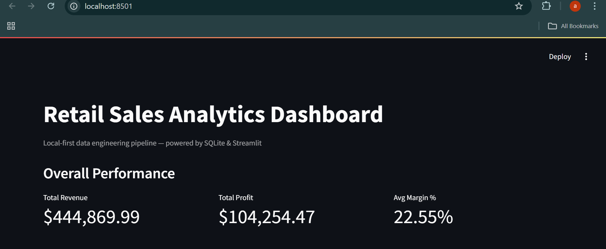
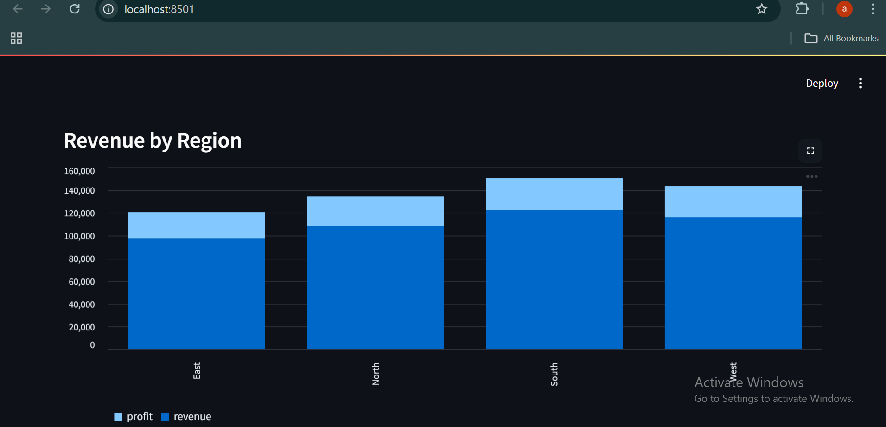
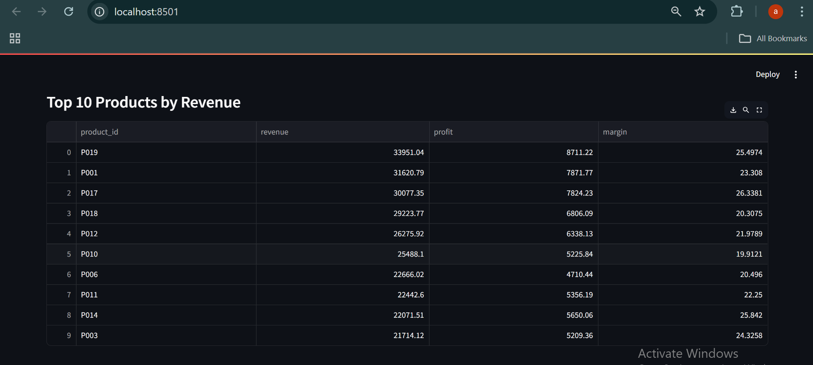
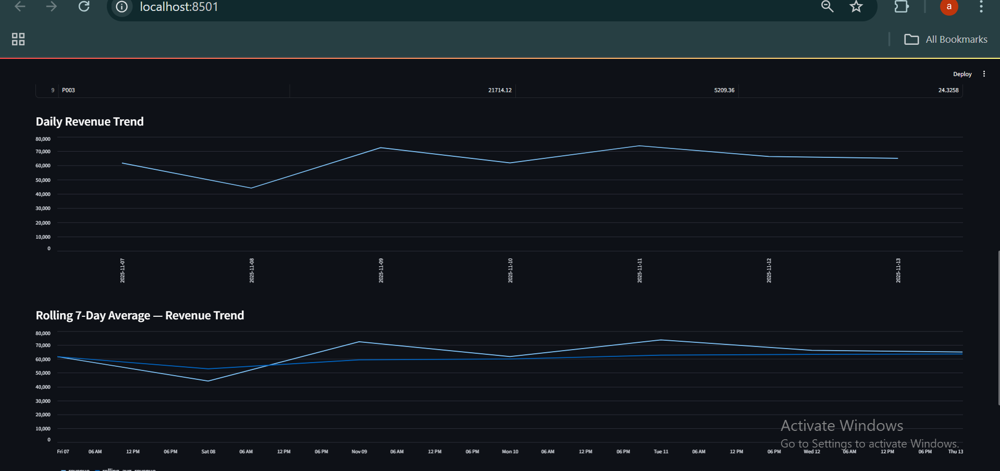
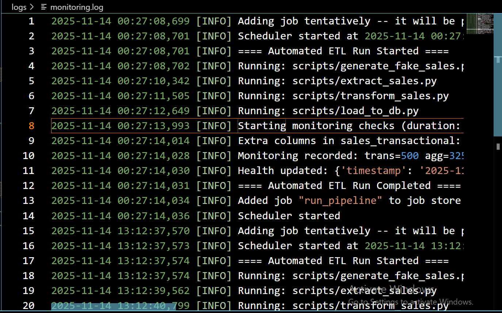
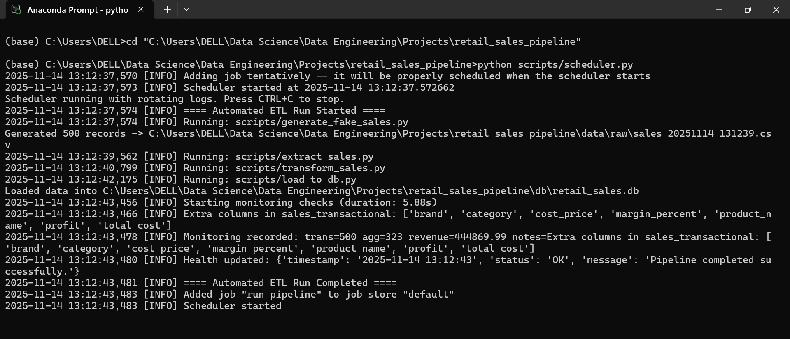

# **Retail Sales Analytics & Monitoring Pipeline**  
*A fully automated, production-structured, local-first data engineering system powering real-time retail insights, monitoring, and alerting.*

---

## **Project Overview**

The **Retail Sales Analytics & Monitoring Pipeline** is an end-to-end data engineering solution that mimics how modern retail organizations collect, validate, transform, store, analyze, and monitor daily sales data.

Built entirely in Python and SQLite, it delivers:

- Automated ETL  
- KPI-rich analytics  
- FastAPI endpoints  
- Streamlit dashboards  
- Continuous monitoring  
- Slack alerting on failures & anomalies  

This project demonstrates **real-world data engineering principles**: modularity, observability, automation, idempotency, and business alignment — all locally, without cloud dependencies.

---

## **Business Impact**

| Business Problem | Implemented Solution | Value Delivered |
|------------------|----------------------|------------------|
| Scattered CSVs & messy data | Schema-validated ingestion | Reliable single source of truth |
| Manual daily reporting | APScheduler-based automation | Zero manual effort, daily refresh |
| Lack of visibility | Streamlit dashboards | Real-time business insights |
| Undetected data breaks | Monitoring + Slack alerts | Immediate detection of issues |
| No trend tracking | Rolling revenue averages | Consistent visibility into momentum |

---

## 🏗 **Architecture**

```
                          ┌──────────────────────────────────────────┐
                          │   Retail Sales Analytics Pipeline (ETL)  │
                          └──────────────────────────────────────────┘
                                           │
                                           ▼
                   ┌──────────────────────────────────────────────┐
                   │   Synthetic Data Generator (Faker CSVs)      │
                   └──────────────────────────────────────────────┘
                                           │
                                           ▼
                   ┌──────────────────────────────────────────────┐
                   │   Ingestion Layer (schema validation)        │
                   └──────────────────────────────────────────────┘
                                           │
                                           ▼
                   ┌──────────────────────────────────────────────┐
                   │   Transformation Layer (KPIs, enrichment)    │
                   └──────────────────────────────────────────────┘
                                           │
                                           ▼
                   ┌──────────────────────────────────────────────┐
                   │      SQLite Warehouse (indexed tables)       │
                   └──────────────────────────────────────────────┘
                        │                           │
                        ▼                           ▼
        ┌───────────────────────────┐   ┌──────────────────────────────┐
        │       FastAPI Service     │   │     Streamlit Dashboard      │
        └───────────────────────────┘   └──────────────────────────────┘
                        │
                        ▼
                   ┌──────────────────────────────────────────────┐
                   │     APScheduler Automation (Daily ETL)       │
                   └──────────────────────────────────────────────┘
                        │
                        ▼
                   ┌──────────────────────────────────────────────┐
                   │ Monitoring, Drift Detection & Slack Alerts   │
                   └──────────────────────────────────────────────┘
```

---

## **Project Structure**

```
retail_sales_pipeline/
│   README.md
│   requirements.txt
│   schema_config.json
│   run_all.py
│
├── dashboard/
│       streamlit_app.py
│
├── data/
│   ├── raw/
│   ├── ingested/
│   ├── processed/
│   └── product_catalog.csv
│
├── db/
│       retail_sales.db
│
├── images/
│       dashboard_kpis.png
│       dashboard_region_chart.png
│       dashboard_top_products.png
│       dashboard_summary.png
│       revenue_trends.png
│       monitoring_log.png
│       scheduler_run.png
│
├── logs/
│       extract_sales.log
│       generate_fake_sales.log
│       load_to_db.log
│       monitoring.log
│       pipeline_health.json
│       scheduler.log
│       transform_sales.log
│
├── scripts/
│       alerts.py
│       api_server.py
│       extract_sales.py
│       generate_fake_sales.py
│       transform_sales.py
│       load_to_db.py
│       monitoring.py
│       scheduler.py
│       __init__.py
│
└── tests/
```

---

## **Key Features**

### Automated ETL Pipeline  
Synth → Ingest → Transform → Load → Serve → Visualize → Monitor.

### Schema Validation  
Strict ingestion validation via `schema_config.json`.

### KPI Computation  
Revenue, cost, profit, margin%, grouped aggregations.

### SQLite Data Warehouse  
Indexed analytical tables for fast API and dashboard queries.

### FastAPI Service  
Exposes:
- `/health`
- `/kpi/revenue`
- `/kpi/top-products`

### Streamlit Dashboard  
Revenue trends, KPIs, regions, top products, rolling averages.

### Monitoring Module  
- Schema drift detection  
- Row count anomalies  
- Revenue deviation alerts  
- Runtime monitoring  
- Persistent monitoring table  

### lack Alerting  
Failure alerts + anomaly detection notifications.

---

## **Dashboard Samples**

### 🔹 KPI Overview


### 🔹 Revenue by Region


### 🔹 Top Products


### 🔹 Rolling Revenue Trend


### 🔹 Summary Insights


### 🔹 Monitoring Log


### 🔹 Scheduler Execution


---

## **Setup Guide**

### Install Dependencies
```bash
pip install -r requirements.txt
```

### Run ETL Manually
```bash
python scripts/generate_fake_sales.py
python scripts/extract_sales.py
python scripts/transform_sales.py
python scripts/load_to_db.py
```

### Launch FastAPI
```bash
uvicorn scripts.api_server:app --reload
```

### Start Dashboard
```bash
streamlit run dashboard/streamlit_app.py
```

### Start Automated Scheduler
```bash
python scripts/scheduler.py
```


**This project demonstrates a complete, production-style retail analytics data platform built entirely with local, lightweight technologies.**
